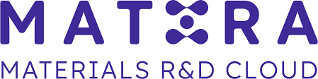

  
🧠 Machine Learning for Microscopy Hackathon 2

  

    <strong>December 16–18, 2025</strong> · Hybrid (In-person + Virtual)
  

  
🎉 Welcome Back!

  
<a href="https://kaliningroup.github.io/mic-hackathon/">Click here</a> to see last year's website.

  
This year we are going <strong>Multi-Site!</strong>

  

    
University of Tennessee, Knoxville (UTK)

    
North Carolina State University (NCSU)

    
Northwestern University (NWU)

    
University of Illinois at Chicago (UIC)

    
Institut Català de Nanociència i Nanotecnologia (ICN2), Barcelona

    
University of Toronto

    
University of Wisconsin

    
University of Colorado Boulder

    
Colorado School of Mines

    
Online (Global)

  

  
If you wish to host a site, please contact <a href="mailto:sergei2@utk.edu">sergei2@utk.edu</a>.

  
🎯 About the Hackathon

  
The <strong>Machine Learning for Microscopy Hackathon</strong> brings together researchers from microscopy, data science, and materials communities to solve <em>real-world problems</em> using AI and machine learning.

  
Whether you are a microscopist, data scientist, or student exploring new tools, this hackathon is designed for you. Our mission is to <strong>bridge microscopy and ML communities</strong>, accelerating innovation in data-driven discovery.

  
<strong>For microscopists:</strong> participation from all imaging fields — electron, scanning probe, and chemical — is encouraged, covering the entire workflow from <em>sample selection → optimization → data analysis → interpretation</em>.

  
<strong>For ML participants:</strong> we invite experts and enthusiasts in <em>image analysis, representation learning, optimization, and active learning</em> to help shape the next generation of intelligent microscopy tools.

  
Let’s build the bridge between <strong>AI and the nanoscale world</strong> together!

  
🌱 Why Participate?

  

    
<strong>🧩 Learn by doing</strong> Work with real microscopy datasets and modern AI workflows.

    
<strong>🌍 Collaborate globally</strong> Join interdisciplinary teams across 10+ international sites.

    
<strong>📖 Contribute to open science</strong> Winning projects may be featured in publications or repositories.

    
<strong>🏆 Gain visibility</strong> Present your results to leading researchers and industry partners.

  

  
<em>Prior programming experience is helpful but not required.</em> Starter materials and tutorials will be provided on the Resources page.

  
🗓️ Timeline

  <table class="table-soft">
    <thead><tr><th>Phase</th><th>Date</th><th>Description</th></tr></thead>
    <tbody>
      <tr><td>Launch & Registration</td><td>Now – Dec 10</td><td>Team formation and Slack/Miro onboarding</td></tr>
      <tr><td>Hackathon Begins</td><td>Dec 16</td><td>Opening session + data problem statements</td></tr>
      <tr><td>Mentorship & Collaboration</td><td>Dec 16–17</td><td>Guidance from mentors across all sites</td></tr>
      <tr><td>Final Presentations & Judging</td><td>Dec 18</td><td>Showcase team results and award winners</td></tr>
      <tr><td>Post-Hackathon</td><td>Jan 2026</td><td>Collaborative paper writing & repository integration</td></tr>
    </tbody>
  </table>

  
🧭 Logistics

  
The hackathon will take place in <strong>hybrid mode</strong> using <strong>Zoom</strong> for seminars and <strong>Slack + Miro</strong> for collaboration.

  <ul>
    <li><a href="https://tiny.utk.edu/slack">Join our Slack group</a></li>
    <li>Miro board link will be provided soon (edit access after joining Slack)</li>
  </ul>

  
🏆 Prizes

  
Exciting prizes for top teams — details coming soon!  
  Awards will include research visibility, sponsor recognition, and hardware tokens.

  
🤝 Sponsors & Partners

  <h4 style="text-align:center; margin-top:10px;">Primary Sponsor</h4>
  

    
  

  <h4 style="text-align:center;">Partners</h4>
  

    
  

  
Interested in sponsoring?  
  Contact <a href="mailto:sergei2@utk.edu">sergei2@utk.edu</a>

  <em>Let’s build the bridge between <strong>AI and microscopy</strong> — together!</em>

